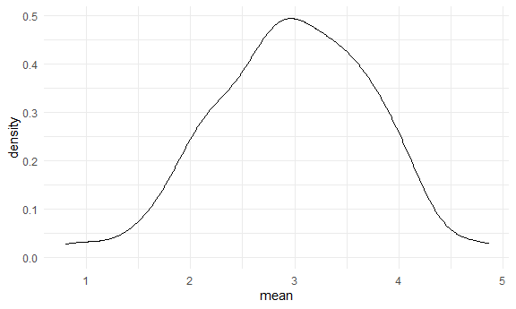

Simulations
================

## Let’s simulate something

I have a function.

``` r
sim_mean_sd = function(samp_size, mu = 3, sigma = 4) {
  
  sim_data = 
    tibble(
      x = rnorm(n = samp_size, mean = mu, sd = sigma)
    )
  
  sim_data %>% 
    summarize(
      mean = mean(x),
      sd = sd(x)
    )
  
}
```

I can “simulate” by running this line.

``` r
sim_mean_sd(30)
```

    ## # A tibble: 1 x 2
    ##    mean    sd
    ##   <dbl> <dbl>
    ## 1  2.61  3.59

## Let’s simulate a lot

Let’s start with a for loop.

``` r
output = vector("list", length = 100)

for (i in 1:100) {
  
  output[[i]] = sim_mean_sd(samp_size = 30)
  
}

bind_rows(output)
```

    ## # A tibble: 100 x 2
    ##     mean    sd
    ##    <dbl> <dbl>
    ##  1  2.67  3.82
    ##  2  2.69  4.02
    ##  3  1.66  5.02
    ##  4  2.79  3.47
    ##  5  2.59  4.80
    ##  6  3.78  4.03
    ##  7  3.35  3.51
    ##  8  2.87  3.42
    ##  9  3.97  3.66
    ## 10  3.04  3.87
    ## # ... with 90 more rows

Let’s use a loop function.

``` r
sim_results = 
  rerun(100, sim_mean_sd(samp_size = 30)) %>% 
  bind_rows()
```

Let’s look at results…

``` r
sim_results %>% 
  ggplot(aes(x = mean)) + geom_density()
```



``` r
sim_results %>% 
  summarize(
    avg_samp_mean = mean(mean),
    sd_samp_mean = sd(mean)
  )
```

    ## # A tibble: 1 x 2
    ##   avg_samp_mean sd_samp_mean
    ##           <dbl>        <dbl>
    ## 1          2.87        0.725

``` r
sim_results %>% 
  ggplot(aes(x = sd)) + geom_density()
```


